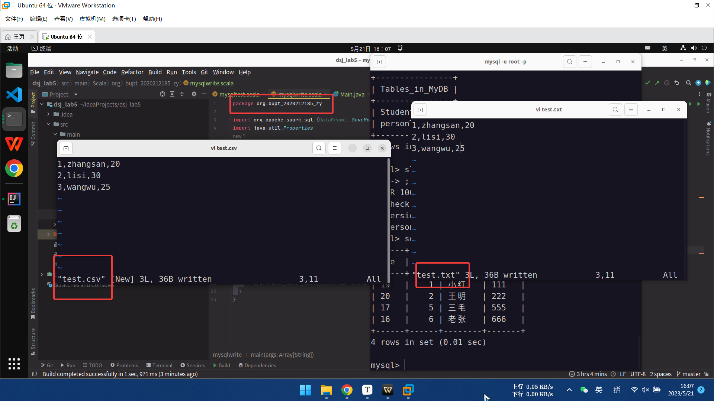

# 实验五：Spark SQL

[TOC]

## 一、加载数据成为分布式表

### 1、mysql 数据：

#### (1) 从数据库中读取数据，并进行查询操作

**准备数据：**


**数据如下：**


**Code:**


**输出结果：**

**查询 1：输出整个表**


**查询 2：输出 ID 大于 1 的男同学的姓名、性别、学号**


#### (2) 从本地读取数据，将查询结果存入 mysql 数据库中

**准备数据：**

`test.json` ：本地文件位置自定义，同时修改 Code 中文件的位置


**操作文件：**

**pom.xml 同上**

**Code：提取年龄小于等于 20 的人的所有信息并存入 MyDB 数据库的 personTable 表中**


**程序输出结果**


**查看数据库中的表，新增了 personTable 表**


**查看 personTable 表中的信息**


### 2、其它三种数据类型文件：

**（文件位置可以自定义，同时修改 Code 中文件的位置）**



**Code (scala):**


**运行结果：**

**输出 data 中每列的名称和类型：**


**输出文件内容，不同文件类型有不同的形式**


## 二、spark sql 实现信息查询

在 SparkSQL 模块中，将结构化数据封装到 DataFrame 或 Dataset 集合中后，提供了两种方式分析处理数据:

1）SQL 编程，将 DataFrame/Dataset 注册为临时视图或表，编写 SQL 语句，类似HiveQL;

2） DSL (domain-specific language)编程，（类似于面向对象）调用 DataFrame/Dataset APIl(函数），类似 RDD 中的函数;

**查询文件 person.txt（文件位置可以自定义，同时修改 Code 中文件的位置）**


**查询需求：**

1、查看 name 字段的数据

2、查看 name 和 age 字段数据

3、查询所有的 name 和 age，并将 age+1

4、过滤 age 大于等于 25 的

5、统计年龄大于 30 的人数

6、按年龄进行分组并统计相同年龄的人数

7、查询姓名==张三的

**pom.xml**：同上

### sql 方式

#### **Code** 


#### **输出结果：**

personDF.printSchema()

personDF.show()


1.查看 name 字段的数据

2.查看 name 和 age 字段数据


3.查询所有的 name 和 age，并将 age+1

4.过滤 age 大于等于 25 的


5.统计年龄大于 30 的人数

6.按年龄进行分组并统计相同年龄的人数

7.查询姓名=张三的


### dsl 方式

#### **Code**


## 三、spark sql 实现 wordcount （单机）

**测试文件 word.txt**

**Code：**


**运行结果：**


## 四、Spark sql 集群形式运行 wordcount 程序

**将测试文件上传到 hdfs 中**


**pom.xml**


**code**


**将程序打成 jar 包，并移动到/opt/spark 文件夹中**


**6、运行**

（1）开启 hadoop

（2）开启 spark

（3) 提交任务

```shell
cd /opt/spark
bin/spark-submit --class org.bupt_2020212185_zy.WordCount --master spark://M2020212185:7077  /root/IdeaProjects/dsj_lab5/target/dsj_lab5-1.0-SNAPSHOT-jar-with-dependencies.jar
```

运行结果


这个路径就很迷惑

code里面是

```java
  val fileDS: Dataset[String] = spark.read.textFile("hdfs://M2020212185:9000/word.txt")
```

到这里面却多了个root

只能cp一下了

运行成功：

